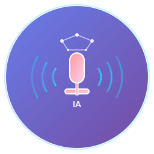

# 🎙️ Transcrição de Áudio com IA

<div align="center">
  
  
  <p><strong>Aplicação desktop para transcrição de áudio com Inteligência Artificial</strong></p>
  
  
  
  
  
</div>

## 📋 Sobre o Projeto

A **Transcrição de Áudio com IA** é uma aplicação desktop moderna desenvolvida com Electron, React e TypeScript que utiliza a API do Google Gemini para transcrever arquivos de áudio com alta precisão. A aplicação oferece uma interface intuitiva e recursos avançados para facilitar o processo de transcrição.

### ✨ Funcionalidades

- 🎵 **Suporte a múltiplos formatos de áudio** (MP3, WAV, M4A, OGG, FLAC)
- 🤖 **Transcrição com IA** usando Google Gemini
- 📝 **Interface moderna e intuitiva**
- 💾 **Exportação de transcrições** em formato de texto
- 📋 **Cópia rápida** para área de transferência
- ⚙️ **Configurações personalizáveis** de API
- 🔒 **Armazenamento seguro** de chaves de API
- 🖥️ **Aplicação desktop nativa** para Windows

## 🚀 Instalação

### Opção 1: Download do Instalador (Recomendado)

1. Acesse a seção de [Releases](../../releases)
2. Baixe o arquivo `Transcrição de Áudio com IA Setup 1.1.0.exe`
3. Execute o instalador e siga as instruções
4. A aplicação será instalada e um atalho será criado na área de trabalho

### Opção 2: Versão Portátil

1. Baixe o arquivo `Transcrição de Áudio com IA 1.1.0.exe`
2. Execute diretamente sem necessidade de instalação

## 🛠️ Desenvolvimento

### Pré-requisitos

- **Node.js** (versão 18 ou superior)
- **npm** ou **yarn**
- **Chave da API do Google Gemini**

### Configuração do Ambiente

1. **Clone o repositório:**
   ```bash
   git clone https://github.com/seu-usuario/transcricao-de-audio-com-ia.git
   cd transcricao-de-audio-com-ia
   ```

2. **Instale as dependências:**
   ```bash
   npm install
   ```

3. **Configure a chave da API:**
   - Obtenha sua chave da API do Google Gemini em [Google AI Studio](https://ai.google.dev/)
   - A chave será solicitada na primeira execução da aplicação

### Scripts Disponíveis

```bash
# Executar em modo de desenvolvimento
npm run dev

# Executar a aplicação Electron em desenvolvimento
npm run electron-dev

# Fazer build para produção
npm run build

# Gerar instaladores
npm run dist

# Executar apenas o Electron
npm run electron
```

## 📖 Como Usar

1. **Inicie a aplicação**
2. **Configure sua chave da API** do Google Gemini (apenas na primeira vez)
3. **Selecione um arquivo de áudio** clicando em "Selecionar Arquivo" ou arrastando o arquivo para a área indicada
4. **Aguarde a transcrição** ser processada pela IA
5. **Visualize o resultado** na área de texto
6. **Copie ou exporte** a transcrição conforme necessário

### Formatos de Áudio Suportados

- **MP3** - MPEG Audio Layer 3
- **WAV** - Waveform Audio File Format
- **M4A** - MPEG-4 Audio
- **OGG** - Ogg Vorbis
- **FLAC** - Free Lossless Audio Codec

## 🏗️ Arquitetura do Projeto

```
├── src/
│   ├── components/          # Componentes React
│   ├── contexts/           # Contextos do React
│   ├── services/           # Serviços de API
│   └── types.ts           # Definições de tipos
├── assets/                # Ícones e recursos
├── main.js               # Processo principal do Electron
├── preload.js            # Script de preload
└── electron-builder.json # Configurações de build
```

## 🔧 Tecnologias Utilizadas

- **[Electron](https://electronjs.org/)** - Framework para aplicações desktop
- **[React](https://reactjs.org/)** - Biblioteca para interfaces de usuário
- **[TypeScript](https://typescriptlang.org/)** - Superset tipado do JavaScript
- **[Vite](https://vitejs.dev/)** - Build tool e dev server
- **[Google Gemini API](https://ai.google.dev/)** - API de Inteligência Artificial
- **[Electron Builder](https://electron.build/)** - Empacotamento e distribuição

## 📄 Licença

Este projeto está sob a licença MIT. Veja o arquivo [LICENSE](LICENSE) para mais detalhes.

## 👨‍💻 Desenvolvedor

**Nereu Jr**
- 📧 Email: [contato@nereujr.com.br](mailto:contato@nereujr.com.br)
- 🌐 Website: [nereujr.com.br](https://nereujr.com.br)
- 📱 WhatsApp: [(77) 99809-4395](https://wa.me/5577998094395)

## 🤝 Contribuindo

Contribuições são sempre bem-vindas! Para contribuir:

1. Faça um fork do projeto
2. Crie uma branch para sua feature (`git checkout -b feature/AmazingFeature`)
3. Commit suas mudanças (`git commit -m 'Add some AmazingFeature'`)
4. Push para a branch (`git push origin feature/AmazingFeature`)
5. Abra um Pull Request

## 🐛 Reportar Problemas

Encontrou um bug ou tem uma sugestão? Abra uma [issue](../../issues) descrevendo:

- Descrição detalhada do problema
- Passos para reproduzir
- Comportamento esperado vs atual
- Screenshots (se aplicável)
- Informações do sistema operacional

## 📝 Changelog

### v1.1.0 (Atual)
- ✅ Adicionadas informações do desenvolvedor no instalador
- ✅ Melhorias na interface do usuário
- ✅ Correções de bugs e otimizações
- ✅ Suporte aprimorado para múltiplos formatos de áudio

### v1.0.0
- 🎉 Lançamento inicial
- 🎵 Suporte básico para transcrição de áudio
- 🤖 Integração com Google Gemini API
- 🖥️ Interface desktop com Electron

---

<div align="center">
  <p>Feito com ❤️ por <strong>Nereu Jr</strong></p>
  <p>Se este projeto foi útil para você, considere dar uma ⭐!</p>
</div>
